# Enterprise Risk Engine (ERM-X)

A working prototype demonstrating unified risk telemetry, business impact quantification, and Agentic AI governance for NYC's payroll and financial systems.

### Purpose

This project normalizes disparate risk sources (cloud, vendor, vulnerability, AI) and weights them against mission-critical services.


### Architecture

```mermaid
%%{init: {
  "theme": "base",
  "flowchart": {
    "curve": "basis",
    "nodeSpacing": 38,
    "rankSpacing": 55
  },
  "themeVariables": {
    "fontFamily": "Inter, Arial, sans-serif",
    "primaryTextColor": "#172033",
    "lineColor": "#94A3B8",
    "background": "#FFFFFF"
  }
}}%%

flowchart LR

%% =========================
%% DATA SOURCES
%% =========================
subgraph A["DATA SOURCES"]
direction TB

    A1["Security<br/>Scanner"]
    A2["Vendor<br/>TPRM"]
    A3["AI<br/>Registry"]
    A4["Ops<br/>Incidents"]
end

%% =========================
%% INGESTION
%% =========================
B["INGESTION & NORMALIZATION<br/><br/>Python ingestion scripts<br/>Standardize heterogeneous inputs<br/>into a unified risk schema"]

%% =========================
%% DATA STORE
%% =========================
subgraph C["CENTRAL RISK DATA STORE"]
direction TB

    C1["Business Services"]
    C2["Risk Portfolio"]
    C3["AI Controls"]
    C4["Risk History"]
    C5["Control Tests"]
    C6["Audit Log"]
end

%% =========================
%% ANALYTICS
%% =========================
D["ANALYTICAL ENGINE<br/><br/>Residual Risk Scoring<br/>Business Impact Weighting<br/>Stress Testing<br/>Monte Carlo Simulation"]

%% =========================
%% PRESENTATION
%% =========================
E["EXECUTIVE RISK DASHBOARD<br/><br/>KPI Cards<br/>Prioritization Queue<br/>AI Risk Spotlight<br/>Business Service View"]

%% =========================
%% FLOWS
%% =========================
A1 --> B
A2 --> B
A3 --> B
A4 --> B

B --> C
C --> D
D --> E

%% =========================
%% STYLES
%% =========================
classDef source fill:#F8FAFC,stroke:#CBD5E1,stroke-width:1.5px,color:#172033,rx:14,ry:14;
classDef ingest fill:#EAF2FF,stroke:#4F6BED,stroke-width:2px,color:#172033,rx:18,ry:18;
classDef store fill:#F2F8F3,stroke:#6FA37A,stroke-width:2px,color:#172033,rx:18,ry:18;
classDef tablebox fill:#FFFFFF,stroke:#C9D4C8,stroke-width:1.2px,color:#172033,rx:10,ry:10;
classDef analytics fill:#FFF6E8,stroke:#C98B2E,stroke-width:2px,color:#172033,rx:18,ry:18;
classDef exec fill:#F7ECF7,stroke:#9B5AA5,stroke-width:2px,color:#172033,rx:18,ry:18;

class A1,A2,A3,A4 source;
class B ingest;
class C1,C2,C3,C4,C5,C6 tablebox;
class D analytics;
class E exec;

```




```text
┌─────────────────────────────────────────────────────────────────┐
│                    DATA SOURCES (Simulated)                     │
│  ┌──────────┐  ┌──────────┐  ┌──────────┐  ┌──────────┐        │
│  │ Security │  │  Vendor  │  │    AI    │  │   Ops    │        │
│  │ Scanner  │  │  TPRM    │  │ Registry │  │Incidents │        │
│  └────┬─────┘  └────┬─────┘  └────┬─────┘  └────┬─────┘        │
└───────┼─────────────┼─────────────┼─────────────┼──────────────┘
        │             │             │             │
        ▼             ▼             ▼             ▼
┌─────────────────────────────────────────────────────────────────┐
│              INGESTION & NORMALIZATION LAYER                    │
│   (Python scripts: 01_ingest.py, ingest_*.py)                   │
│   Maps heterogeneous schemas → unified risk_portfolio schema    │
└──────────────────────────┬──────────────────────────────────────┘
                           │
                           ▼
┌─────────────────────────────────────────────────────────────────┐
│                    DATA STORE (SQLite)                          │
│  ┌────────────────┐  ┌────────────────┐  ┌────────────────┐    │
│  │ business_      │  │ risk_          │  │ ai_            │    │
│  │ services       │  │ portfolio      │  │ controls       │    │
│  └────────────────┘  └────────────────┘  └────────────────┘    │
│  ┌────────────────┐  ┌────────────────┐  ┌────────────────┐    │
│  │ risk_history   │  │ control_tests  │  │ audit_log      │    │
│  └────────────────┘  └────────────────┘  └────────────────┘    │
└──────────────────────────┬──────────────────────────────────────┘
                           │
                           ▼
┌─────────────────────────────────────────────────────────────────┐
│               ANALYTICAL ENGINE (Python/pandas)                 │
│   Weighted residual risk calculation                            │
│   Business impact weighting                                     │
│   Monte Carlo simulation (optional)                             │
│   Stress-test scenario engine                                   │
└──────────────────────────┬──────────────────────────────────────┘
                           │
                           ▼
┌─────────────────────────────────────────────────────────────────┐
│              PRESENTATION LAYER (Streamlit)                     │
│   Executive KPI cards                                           │
│   Prioritization queue                                          │
│   AI risk spotlight                                             │
│   Business service reference                                    │
└─────────────────────────────────────────────────────────────────┘
```


### Quick Start

```bash
git clone https://github.com/hibdiop/fisa-erm-x.git
cd fisa-erm-x
python -m venv venv
source venv/bin/activate  # or venv\Scripts\activate on Windows
pip install -r requirements.txt
python scripts/01_ingest.py
streamlit run app.py 
```

## Reference Frameworks

| Framework | Purpose | Link |
|---|---|---|
| NIST CSF 2.0 | Cybersecurity framework | [nist.gov/cyberframework](https://nist.gov/cyberframework) |
| NIST AI RMF 1.0 | AI risk management | [nist.gov/itl/ai-risk-management-framework](https://nist.gov/itl/ai-risk-management-framework) |
| OWASP Top 10 for LLMs | LLM security risks | [owasp.org/www-project-top-10-for-large-language-model-applications](https://owasp.org/www-project-top-10-for-large-language-model-applications) |
| ISO/IEC 27001 | Information security management | [iso.org/standard/27001](https://iso.org/standard/27001) |
| COSO ERM | Enterprise risk management | [coso.org](https://coso.org/) |
| FAIR | Quantitative risk analysis | [fairinstitute.org](https://fairinstitute.org/) |

## Streamlit Snapshot


### Key Finding
An autonomous AI agent with write-access to the payroll ledger scores 12.00 / 15.0 — the highest enterprise risk in the portfolio. See docs/EXECUTIVE_MEMO.md for the Triple-Gate governance framework.


### Tech Stack
- Python 3.10+
- SQLite3
- pandas
- Streamlit
- OWASP Top 10 for LLMs / NIST AI RMF (conceptual alignment)

